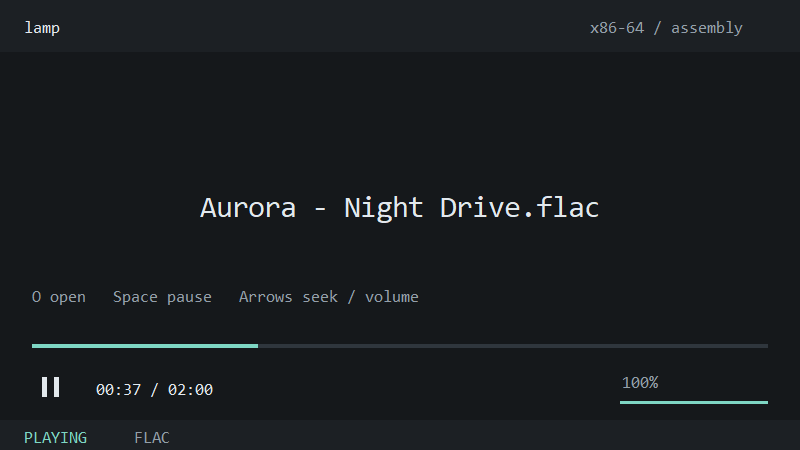

<p align="center"></p>

# LAMP — Lev's Assembly Media Player

A small Windows x86-64 media player with handwritten assembly decoders and a native assembly UI. Audio comes first. The long-term goal is to support the relevant formats and playback features people use in **mpv**, with a small runtime and low CPU use.

**Current version: 0.3.0, an early audio prototype.** WAV, native FLAC, MP3, and Ogg/Vorbis play today. Opus components are being developed; **Opus audio playback is not available yet**. Video, subtitles, and network streaming are future work.

[Website](https://levkropp.github.io/lamp/) · [Download v0.3.0](https://github.com/levkropp/lamp/releases/tag/v0.3.0) · [Roadmap](ROADMAP.md) · [Compatibility matrix](docs/compatibility.md) · [Technical details and limits](docs/technical.md)



## Why LAMP?

- MASM x86-64 runtime, including the working audio decoders; SSE2 baseline.
- Event-driven WASAPI playback, a decode worker, and buffered PCM to absorb short scheduling stalls.
- A compact mpv-inspired UI, with Rhun's assembly UI approach and minimalist visual style as references.
- No codec DLL, C runtime, FFmpeg subprocess, or mpv engine in the player. Normal Windows system DLLs provide platform services.
- MIT project license, with preserved MIT/MIT-0/CC0/BSD notices for reference-derived algorithms and data.

LAMP aims to reduce stutters. It cannot guarantee uninterrupted playback during arbitrary system or driver stalls. We have not yet benchmarked it against mpv or VLC on the same machine.

## Run

Windows 10/11 x64 and a working default audio output are the intended targets. Download and extract the [v0.3.0 Windows archive](https://github.com/levkropp/lamp/releases/tag/v0.3.0), or build from source. Open `bin\lamp.exe` and drop a supported audio file onto the window. The release is an early prerelease.

```powershell
.\bin\lamp.exe 'C:\Music\track.ogg'
.\bin\lamp-cli.exe 'C:\Music\track.flac'
.\bin\lamp-cli.exe --check 'C:\Music\track.mp3'
.\bin\lamp-cli.exe --decode 'C:\Music\track.ogg' '.\track.f32'
```

`--check` decodes without an audio device. `--decode` writes source-rate, little-endian float32 PCM with two interleaved channels; mono is duplicated. The destination must be new. Failed exports can leave partial output.

| Format | Current support |
| --- | --- |
| WAV | Little-endian RIFF, PCM 8/16/24/32-bit or float32, mono/stereo, 8–192 kHz |
| Native FLAC | Mono/stereo, 4–24-bit, 8–192 kHz; CRC checks |
| MP3 | MPEG-1/2/2.5 Layer III, mono/stereo, CBR/VBR, encoder trimming when tagged |
| Ogg/Vorbis | Single logical stream, mono/stereo, floor 1, mapping 0; CRC and granule checks |
| Ogg/Opus | Development only; playback unavailable |

See [precise coverage, limitations, and verification](docs/technical.md) before relying on a particular stream variant. Multichannel, chained Ogg streams, FLAC-in-Ogg, and indexed seeking are not implemented.

## Controls

| Control | Action |
| --- | --- |
| O / Ctrl+O; file drop | Open audio |
| Space; playback button | Pause/resume or replay |
| Left / Right | Seek ±5 seconds |
| Home; timeline click | Start; seek to position |
| Up / Down; volume bar | Adjust volume |
| M | Mute/unmute to 100% |
| Q | Close |

The controls hide after 2.5 seconds of inactivity during playback. Seeking currently decodes from the beginning on a worker, so distant seeks take longer. The console accepts Space to pause and Q/Ctrl+C to stop.

## Build and verify

Install **Visual Studio 2022 Build Tools**, its x64 C++ tools, and a **Windows SDK**. Build scripts locate `ml64`, `link`, and `rc` automatically:

```powershell
.\build.ps1
node .\tests\verify-runtime.js
node .\tests\smoke.js
.\tests\render-ui.ps1
.\package.ps1
```

The prebuilt ICO and decoder tables are included. A normal build needs no codec library or reference C compiler. Both players use custom assembly entry points and `/NODEFAULTLIB`. The branded build measures **110,080 bytes for `lamp.exe`** and **102,400 bytes for `lamp-cli.exe`**, including icon resources; release manifests record exact sizes and hashes.

The existing codec suites recorded 43 WAV/FLAC, 103 MP3, and 83 Vorbis checks, plus engine lifecycle, malformed-input, stress, and Opus primitive tests. They do not establish complete format conformance. [Test instructions](docs/technical.md#verification) and [recorded reports](reports/README.md) describe what was checked. Full fixture suites need FFmpeg and Node.js; Opus oracle tests additionally use the C compiler for test executables only.

The UI image comes from the actual assembly renderer with synthetic state. Open-dialog, drag/drop, and monitor-DPI interaction still require desktop verification.

## Roadmap and contribution

Latest Opus work adds reference-checked CELT static allocation, normalized pulse-vector reconstruction/spreading, and time/frequency layout kernels, all in assembly. These stages are assembled and tested but not yet integrated into audio playback. See [the decoder-stage notes](docs/opus.md) and run `./tests/verify-opus-components.ps1` to reproduce their checks without FFmpeg or an audio device.

[ROADMAP.md](ROADMAP.md) covers Opus, reliable audio playback, broader codecs and containers, video, subtitles, streaming, and eventual support for everything relevant that mpv supports. The [compatibility matrix](docs/compatibility.md) tracks the current gaps. Goals have acceptance gates, not promised release dates. Hardware decode should be used when it lowers system cost; handwritten assembly alone does not guarantee a faster codec.

Keep runtime and codec code in assembly. Use original implementations or carefully attributed permissive references (MIT, MIT-0, BSD-2-Clause, BSD-3-Clause, or CC0). Preserve applicable notices. Test tools may use other languages. Please include the failing media characteristics, a redistributable fixture when possible, and a reference comparison when reporting decoder issues.

## License and references

Original LAMP code and brand assets are [MIT licensed](LICENSE). See [THIRD_PARTY_NOTICES](THIRD_PARTY_NOTICES) for reference-derived code/data and test reference sources. No Rhun source or logo assets are included.

- [Rhun](https://rhun.app/) / [assembly UI reference](https://github.com/vshvedov/rhun)
- [mpv](https://mpv.io/) / [feature reference](https://mpv.io/manual/stable/)
- [Vorbis specification](https://xiph.org/vorbis/doc/Vorbis_I_spec.html)
- [Opus RFC 6716](https://www.rfc-editor.org/rfc/rfc6716.html) / [Ogg Opus RFC 7845](https://www.rfc-editor.org/rfc/rfc7845.html)
